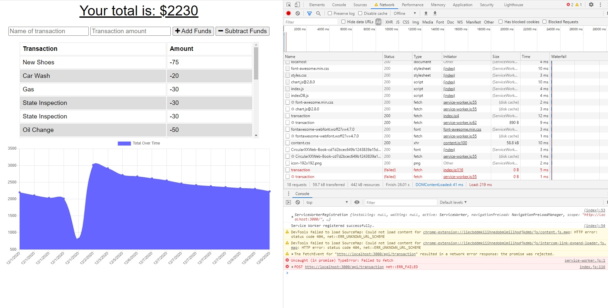
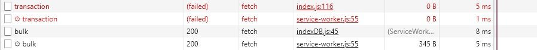

# Budget-Me 

## Table of Contents
1. [Description](#description)
2. [Installation](#installation-instructions)
3. [Usage](#usage-information)
4. [Contribution](#contribution-guidelines)
5. [Test](#test-instructions)
6. [Questions & Contact](#questions?-contact-information-below)
### Description
This app is designed to allow users to add expenses and income to help keep track of total income. It also allows users to update their expenses or income when offline and then adds/subtracts it the total when online. 

### Installation Instructions
Download all files and properly install through npm. 

### Usage Information
Use "node server" to start the app up

### Contribution Guidelines
See contact information

### Test Instructions
"node server"

### Questions and Contact Information Below
#### Github Username: crystalcrandall92
#### Github Link: https://github.com/crystalcrandall92
#### Email: crystalcrandall92@yahoo.com

